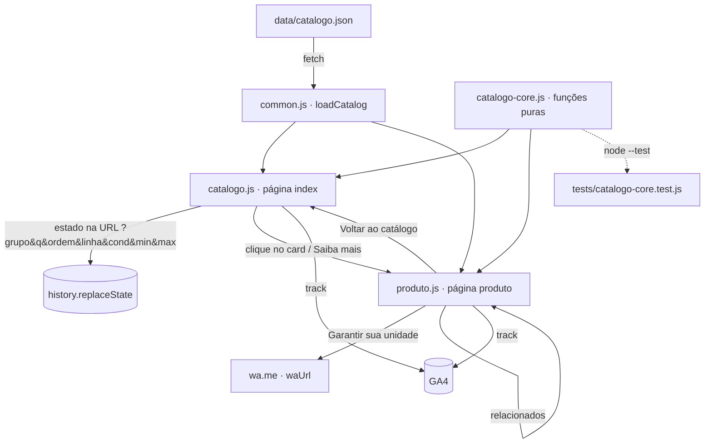

# Catálogo e Ficha de Produto Design

**Spec**: `.specs/features/catalogo-e-ficha-produto/spec.md`
**Status**: Draft
**Cobre também**: a base compartilhada usada por `vantagens-jciphones` e `pagina-inicio-bio`, que por serem simples não têm design próprio.

---

## Architecture Overview

Continua um site estático sem build (GitHub Pages). Duas mudanças estruturais:

1. **CSS e JS saem do `index.html` para arquivos compartilhados**, porque agora são 3 páginas (`index.html`, `produto.html`, `bio/index.html`). Sem isso, nav, botões, `waUrl()` e `track()` seriam copiados três vezes.
2. **A lógica do catálogo fica em duas camadas**: um núcleo puro, sem DOM (filtrar, ordenar, relacionados, formatar), que roda no navegador e no Node para testes; e as camadas de página, que só leem o DOM, chamam o núcleo e renderizam.



### Estrutura de arquivos resultante

```
jciphone/
├── index.html                  # hero + #catalogo + vantagens + seções atuais
├── produto.html                # ficha (conteúdo renderizado via JS)
├── bio/index.html              # link-na-bio (estático, só usa common.css/js)
├── data/
│   └── catalogo.json           # fonte única do catálogo
├── static/
│   ├── css/site.css            # tokens + nav + botões + footer + reveal (extraído do index)
│   ├── css/catalogo.css        # cards, abas, toolbar, gaveta de filtros, ficha, vantagens
│   ├── js/common.js            # WA_NUMBER, waUrl, track, nav/menu, reveal, [data-wa-text], loadCatalog, vantagens
│   ├── js/catalogo-core.js     # funções puras (browser + Node)
│   ├── js/catalogo.js          # página index: estado, toolbar, grid
│   ├── js/produto.js           # página produto: ficha, galeria, relacionados
│   └── produtos/<slug>/1.jpg…  # fotos dos produtos
└── tests/
    └── catalogo-core.test.js   # node --test, sem dependências
```

---

## Code Reuse Analysis

### Existing Components to Leverage

| Component | Location | How to Use |
| --- | --- | --- |
| Tokens `:root` (`--accent`, `--whatsapp`, `--radius*`, `--ease`, `--font`) | `index.html` `<style>` | Movidos sem alteração para `static/css/site.css` |
| `.btn`, `.btn-whatsapp`, `.btn-ghost`, `.btn-primary` | `index.html` `<style>` | O botão "Garantir sua unidade" é `.btn .btn-whatsapp .btn-lg`; "Limpar filtros" é `.btn-ghost` |
| `waUrl(message)` + `WA_NUMBER` | script final do `index.html` | Movidos para `common.js` e expostos em `window.JC` |
| `track(eventName, params)` | script final do `index.html` | Movido para `common.js`; os novos eventos passam por ele |
| Varredura `[data-wa-text]` | script final do `index.html` | Vira `JC.bindWaLinks(root)` para rodar de novo depois de renderizar conteúdo dinâmico |
| `.reveal` + `IntersectionObserver` | script final do `index.html` | Vira `JC.observeReveal(root)`; os cards renderizados chamam essa função depois de inseridos |
| Nav fixa + menu mobile | `index.html` | Mesmo HTML copiado em `produto.html` (links apontam para `./#...`); JS em `common.js` |
| `section_view`, `scroll_depth`, `time_on_page` | script final do `index.html` | Continuam em `common.js`, então passam a valer para as 3 páginas |

### Concerns (de `CONCERNS.md`) tratados aqui

| Concern | Mitigação no design |
| --- | --- |
| Sem testes | `catalogo-core.js` é puro e roda com `node --test`, sem instalar nada |
| Imagens pesadas | Cards usam `loading="lazy"`, `width/height` e `aspect-ratio`. Recomendação no JSON: fotos de até 1000px e ~150KB |
| `WA_NUMBER` placeholder | Continua em **um único lugar** (`common.js`), então a troca antes do deploy é trivial |

**Bug existente encontrado:** no toggle do menu mobile, `iconMenu.outerHTML = ...` substitui o nó, e a variável `iconMenu` fica apontando para um elemento que já saiu da página. A partir do segundo clique o ícone não troca mais. Como o código vai ser movido para `common.js`, corrigir ali trocando o `innerHTML` de `toggle` em vez do `outerHTML` do ícone.

### Integration Points

| System | Integration Method |
| --- | --- |
| GitHub Pages | Caminhos **relativos** (sem `/` inicial), para funcionar tanto em domínio próprio quanto em `usuario.github.io/repo/`. A `bio/` usa `../` |
| WhatsApp | `JC.waUrl(JC.productMessage(p))` |
| GA4 | Novos eventos, listados abaixo |

---

## Components

### `catalogo-core.js` — núcleo puro

- **Purpose**: toda a regra de negócio do catálogo, sem tocar no DOM
- **Location**: `static/js/catalogo-core.js`
- **Export**: `window.JCCore` no navegador; `module.exports` no Node (`if (typeof module !== "undefined")`)
- **Interfaces**:
  - `normalize(str): string`: minúsculas e sem acento (`NFD` + remoção de diacríticos)
  - `isAvailable(p): boolean`: `p.estoque == null || p.estoque > 0`
  - `filterProducts(products, state): Product[]`: aplica grupo, busca (`normalize(nome).includes(normalize(q))`), faixa de preço, linhas (OU entre elas) e condições (OU entre elas); critérios diferentes são combinados com E
  - `sortProducts(products, ordem): Product[]`: `menor-preco` \| `maior-preco` \| `recente` (`adicionadoEm` desc, empate por `nome`). Retorna uma cópia
  - `linesFor(products, grupo): string[]`: linhas distintas do grupo, em ordem alfabética natural (`localeCompare` com `numeric: true`, para "iPhone 9" vir antes de "iPhone 13")
  - `normalizePriceRange(min, max): {min, max}`: ignora vazios e troca os dois se `min > max`
  - `discountPercent(p): number | null`: `round((precoOriginal - preco) / precoOriginal * 100)` quando `precoOriginal > preco`
  - `urgencyLabel(p): string | null`: `"Última unidade"` quando o estoque é 1, `"Últimas 2 unidades"` quando é 2
  - `relatedProducts(products, current, limit = 4): Product[]`: disponíveis, sem o atual; primeiro os do mesmo `tipo`, depois os do mesmo `grupo`, depois os demais, cada bloco ordenado por proximidade de preço
  - `formatPrice(n): string`: `Intl.NumberFormat("pt-BR", {style:"currency", currency:"BRL"})`
  - `stateFromQuery(search): CatalogState` / `stateToQuery(state): string`: serialização da URL (CAT-11)
- **Dependencies**: nenhuma
- **Reuses**: nada, é código novo

### `common.js` — base compartilhada

- **Purpose**: tudo que as 3 páginas usam em comum
- **Location**: `static/js/common.js`, carregado com `defer` em todas as páginas
- **Interfaces** (em `window.JC`):
  - `WA_NUMBER`, `waUrl(message)`, `track(event, params)`: movidos do index sem mudança de comportamento
  - `bindWaLinks(root = document)`: varre `[data-wa-text]` e evita ligar o mesmo link duas vezes (marca com `data-wa-bound`)
  - `observeReveal(root = document)`
  - `loadCatalog(): Promise<Catalog>`: faz `fetch("data/catalogo.json")` (o caminho é passado pela página), valida `Array.isArray(json.produtos)` e guarda o resultado em memória
  - `productMessage(p): string`: `"Olá! Tenho interesse no {nome} ({Novo|Seminovo}) por {preço}. Ainda está disponível?"`
  - `renderVantagens(el, variant)`: `variant = "full" | "compact"`, a partir da constante `VANTAGENS` (resolve VANT-01/03 com **uma única fonte de texto**)
  - `escapeHtml(str)`: todo texto vindo do JSON passa por aqui antes de ir para `innerHTML`
  - `renderCard(p, listName)`: HTML do card de produto (fica aqui, e não no núcleo, porque gera HTML; é usado pelo catálogo e pelos relacionados)
- **Reuses**: o script final atual do `index.html`

### `catalogo.js` — seção `#catalogo` da home

- **Purpose**: controlar o estado do catálogo e renderizar toolbar e grid
- **Location**: `static/js/catalogo.js`
- **Interfaces**:
  - `init()`: lê o estado da URL, mostra os skeletons, chama `loadCatalog()` e depois `render()`
  - `setState(patch)`: junta o patch ao estado, chama `replaceState` na URL (mantendo `#catalogo`) e depois `render()`
  - `render()`: `filterProducts` → `sortProducts` → HTML do grid, contador de resultados, badge "Filtros (n)" e opções de linha
  - `openFilters()` / `closeFilters()`: gaveta com classe `.open`, no mesmo padrão do menu mobile; fecha com Esc, clique no fundo ou "Ver N resultados"
- **Dependencies**: `JC`, `JCCore`
- **Reuses**: padrão de toggle de classe do menu mobile, `observeReveal`, `bindWaLinks`

### Seção `#catalogo` (HTML em `index.html`)

Substitui a seção `#produtos` atual. O link "Produtos" do menu passa a se chamar "Catálogo" e apontar para `#catalogo`, e o "Ver produtos" do hero também aponta para `#catalogo`.

```
#catalogo
├── .catalog-tabs          [Dispositivos] [Acessórios]          ← role="tablist"
├── .catalog-toolbar
│   ├── input[type=search]  "Buscar por nome…"
│   ├── select              Mais recente | Menor preço | Maior preço
│   └── button              "Filtros (n)"
├── .catalog-count         "12 produtos"                          ← aria-live="polite"
├── .catalog-grid          cards | skeletons | estado vazio | estado de erro
└── .filter-drawer         Preço (mín/máx) · Linha (checkboxes) · Condição (checkboxes)
                           [Limpar filtros] [Ver N resultados]
```

Layout da toolbar: no desktop fica tudo em uma linha. No celular, a busca ocupa a linha inteira e a ordenação e os filtros dividem a linha de baixo.

### Card de produto

```html
<a class="product-card reveal" href="produto.html?p={slug}" data-slug="{slug}">
  <div class="product-media">
    
    <span class="tag tag-{condicao}">{Novo|Seminovo}</span>
    <span class="tag tag-urgencia">{urgencyLabel}</span>          <!-- opcional -->
  </div>
  <h3 class="product-name">{nome}</h3>                              <!-- 2 linhas, line-clamp -->
  <div class="product-price">
    <s>{precoOriginal}</s> <span class="tag tag-promo">-{desconto}%</span>  <!-- opcional -->
    <strong>{preco}</strong>
    <small>ou {parcelamento}</small>                                   <!-- opcional -->
  </div>
  <span class="btn btn-primary btn-sm">Saiba mais</span>
</a>
```

O card inteiro é um único link (CAT-05 cobre tanto o clique no card quanto o "Saiba mais"). "Saiba mais" é um `<span>` estilizado como botão, porque colocar `<button>` dentro de `<a>` é HTML inválido. Grid: `repeat(2, 1fr)` no celular, 3 colunas a partir de 768px e 4 a partir de 1024px.

### `produto.html` + `produto.js` — ficha

- **Purpose**: tela de detalhes de um produto
- **Location**: `produto.html` (nav, main vazio com skeleton, footer) + `static/js/produto.js`
- **Interfaces**:
  - `init()`: lê `?p=`, chama `loadCatalog()`, encontra o produto pelo `slug`, e mostra a ficha ou o estado "não encontrado"
  - `renderProduct(p)`: galeria, nome, tags, preço, botão "Garantir sua unidade", `renderVantagens(el, "compact")`, especificações e relacionados
  - `renderGallery(imagens)`: imagem principal + miniaturas (botões). No celular, `scroll-snap` horizontal permite o swipe sem biblioteca
  - `updateMeta(p)`: `document.title = "{nome} | JC Iphones"` e `meta[name=description]`
- **Layout**: no celular, uma coluna (galeria → nome/preço → botão → vantagens → specs → relacionados). No desktop, duas colunas (galeria | informações, com a coluna de informações `sticky`)
- **CTA**: `<a class="btn btn-whatsapp btn-lg btn-block">Garantir sua unidade</a>`. No celular, uma barra fixa no rodapé repete preço + botão quando o botão original sai da tela (`IntersectionObserver`). Isso garante o critério 3 de CAT-06 mesmo com galeria grande
- **Voltar ao catálogo**: se `document.referrer` é do mesmo site e é a home, usa `history.back()`, que devolve a posição de rolagem e os filtros pela URL. Senão, navega para `./#catalogo`
- **Relacionados**: `relatedProducts()` + o mesmo `JC.renderCard(p)` usado no catálogo
- **Reuses**: `JC.renderCard`, `JC.renderVantagens`, `JC.productMessage`, `JC.waUrl`, `JC.track`

---

## Data Models

### `data/catalogo.json`

```jsonc
{
  "atualizadoEm": "2026-09-23",
  "produtos": [
    {
      "slug": "iphone-13-128gb-seminovo",          // único, [a-z0-9-]
      "nome": "iPhone 13 128GB",
      "grupo": "dispositivo",                     // "dispositivo" | "acessorio"
      "tipo": "iphone",                           // iphone | notebook | tablet | caixa-de-som | fone | capa | apple-watch | carregador | …
      "linha": "iPhone 13",                       // opcional; alimenta o filtro "Linha"
      "condicao": "seminovo",                     // "novo" | "seminovo"
      "preco": 3199,                              // reais, número (sem centavos em string)
      "precoOriginal": 3799,                      // opcional
      "parcelamento": "10x de R$ 319,90",         // opcional, texto livre
      "estoque": 2,                               // opcional; 0 = oculto; 1–2 = urgência
      "adicionadoEm": "2026-09-20",               // AAAA-MM-DD
      "imagens": [
        "static/produtos/iphone-13-128gb-seminovo/1.jpg",
        "static/produtos/iphone-13-128gb-seminovo/2.jpg"
      ],
      "especificacoes": [                         // opcional; array preserva a ordem de exibição
        { "rotulo": "Armazenamento", "valor": "128GB" },
        { "rotulo": "Bateria", "valor": "89%" },
        { "rotulo": "Cor", "valor": "Meia-noite" },
        { "rotulo": "Tela", "valor": "6,1\" Super Retina XDR" }
      ],
      "tags": ["Promoção"]                        // opcional; selos extras livres
    }
  ]
}
```

**Por que `especificacoes` é um array e não um objeto:** a ordem de exibição fica sob controle do lojista, e cada produto pode ter rótulos diferentes (fone ≠ iPhone).

### `CatalogState` (em memória e na URL)

```ts
interface CatalogState {
  grupo: "dispositivo" | "acessorio"   // ?grupo=   padrão: dispositivo
  q: string                            // ?q=
  ordem: "recente" | "menor-preco" | "maior-preco"  // ?ordem=  padrão: recente
  linhas: string[]                     // ?linha=iPhone%2013,iPhone%2014
  condicoes: ("novo" | "seminovo")[]   // ?cond=novo,seminovo
  min: number | null                   // ?min=
  max: number | null                   // ?max=
}
```

Valores padrão não entram na URL. Assim a home "limpa" continua com a URL `/`.

---

## Eventos GA4 (novos)

| Evento | Quando | Parâmetros |
| --- | --- | --- |
| `catalog_group` | troca de aba | `grupo` |
| `catalog_search` | 1s depois da última tecla, se o termo tiver ≥ 2 caracteres | `search_term`, `results` |
| `catalog_sort` | troca de ordenação | `ordem` |
| `catalog_filter` | ao fechar a gaveta com filtros alterados | `linhas`, `condicoes`, `min`, `max`, `results` |
| `select_item` | clique em um card (catálogo ou relacionados) | `item_id`=slug, `item_name`, `price`, `item_list_name` (`catalogo` \| `relacionados`) |
| `view_item` | ficha renderizada | `item_id`, `item_name`, `price`, `item_category`=tipo |
| `whatsapp_click` | "Garantir sua unidade" | já existente + `link_location: "ficha"`, `item_id` |

`select_item` e `view_item` são nomes de eventos recomendados do GA4 para e-commerce, e aparecem nos relatórios padrão sem configuração extra.

---

## Error Handling Strategy

| Error Scenario | Handling | User Impact |
| --- | --- | --- |
| `fetch` do JSON falha / JSON inválido / sem `produtos` | `loadCatalog` rejeita; a página mostra o bloco de erro | "Não conseguimos carregar o catálogo agora." + botão de WhatsApp. O resto da página funciona |
| Busca/filtros sem resultado | `render()` mostra o estado vazio | "Nenhum produto encontrado" + "Limpar filtros" + "Não achou? Fale com a gente" (WhatsApp) |
| `?p=` ausente, slug inexistente ou estoque 0 | `produto.js` mostra o estado "não encontrado" | "Produto não encontrado ou já vendido" + "Ver catálogo" + WhatsApp |
| Imagem quebrada | `img.onerror` troca por um placeholder neutro (SVG inline em CSS `background`) | Card mantém o layout |
| Produto com campo obrigatório faltando | `loadCatalog` descarta o item e registra `console.warn` com o slug | Produto não aparece; o lojista vê o aviso no console. O teste de validação do JSON pega isso antes (ver abaixo) |
| Aberto via `file://` | `fetch` falha e cai no mesmo estado de erro | Só em desenvolvimento; o README orienta `python3 -m http.server` |
| JS desabilitado | `<noscript>` dentro de `#catalogo` | Mensagem + link do WhatsApp |

**Validação do JSON:** `tests/catalogo-core.test.js` também carrega o `data/catalogo.json` real e verifica: slugs únicos, campos obrigatórios, `grupo` e `condicao` com valores válidos, e se cada caminho em `imagens` existe no disco. Rodar `node --test` antes de cada deploy pega erros de digitação do lojista.

---

## Tech Decisions (only non-obvious ones)

| Decision | Choice | Rationale |
| --- | --- | --- |
| CSS/JS inline vs. arquivos | Extrair para `static/css` e `static/js` | 3 páginas compartilham nav, botões, tokens, WhatsApp e GA4. Muda a convenção de "arquivo único" registrada em `CONVENTIONS.md`, que precisa ser atualizada |
| Framework / bundler | Nenhum; JS vanilla ES5-style (`var`, IIFE) como o código atual | Mantém o deploy direto no GitHub Pages e o estilo existente |
| Ficha: página própria vs. modal | `produto.html?p=slug` | Decisão do spec: link compartilhável no WhatsApp e botão "voltar" nativo |
| Estado do catálogo | Query string com `replaceState` | Voltar da ficha restaura os filtros sem `sessionStorage`, e dá para compartilhar um link já filtrado |
| Gaveta de filtros: `<dialog>` vs. div | `div` + classe `.open` | Mesmo padrão do menu mobile e sem depender do suporte a `<dialog>` em Safari antigo |
| Filtros: aplicar ao vivo vs. botão "Aplicar" | Ao vivo, com o contador "Ver N resultados" no botão da gaveta | O visitante vê o efeito antes de fechar; no desktop a gaveta vira painel e o grid atualiza atrás |
| Busca | Atualiza a cada tecla (lista pequena), GA4 com debounce de 1s | 100 produtos filtram em < 1ms; debounce só para não poluir o analytics |
| Renderização | Template string + `escapeHtml` | Mais curto que `createElement` e seguro, porque todo texto do JSON é escapado |
| Galeria no celular | CSS `scroll-snap` | Swipe nativo, sem biblioteca |
| Testes | `node --test` (embutido no Node ≥ 18) | Zero dependências e nenhum `package.json` obrigatório |
| Cache do JSON | Padrão do GitHub Pages (~10 min) | Aceitável. Se o lojista precisar ver a mudança na hora, adicionar `?v={data}` no fetch |

---

## Resumo para `vantagens-jciphones` e `pagina-inicio-bio` (sem design próprio)

- **Vantagens:** `JC.renderVantagens(el, "full")` em uma nova seção `#vantagens` logo depois de `#catalogo`, e `"compact"` na ficha. A seção `#porque` fica com "Atendimento próximo" e "Loja física" (sem duplicar garantia/pagamento), ou é removida se ficar com só 2 itens. Isso fica para validar visualmente na execução.
- **Bio:** `bio/index.html` estático, usa `../static/css/site.css` e `../static/js/common.js` (WhatsApp, GA4, `data-wa-text`). Não carrega o catálogo. Os botões usam os ícones SVG no mesmo estilo dos já usados no site.
